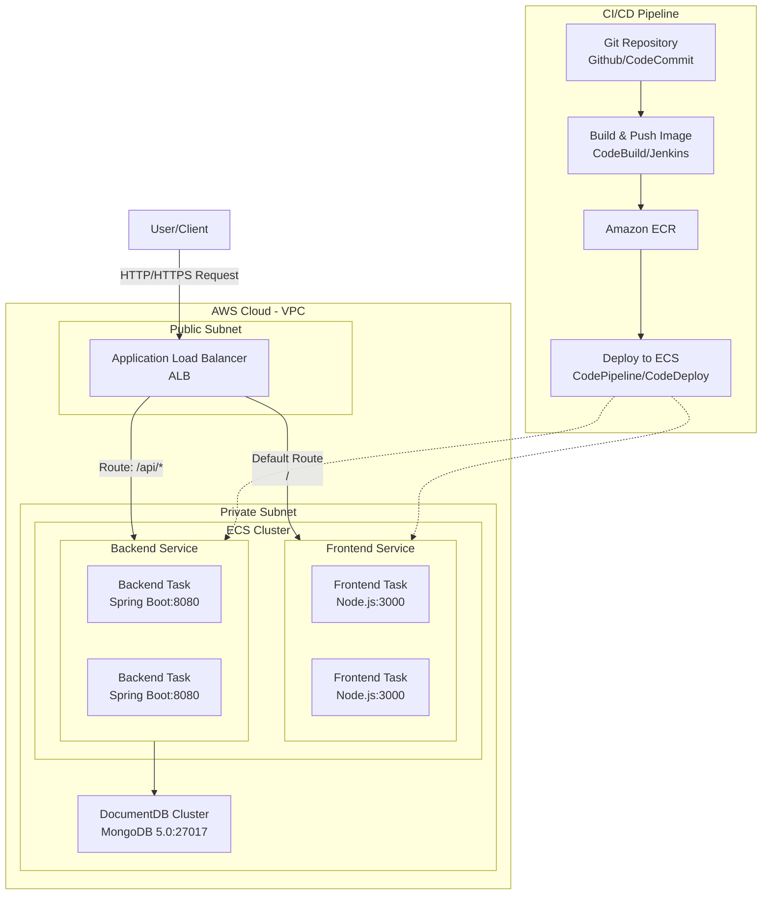

```mermaid
flowchart TD
    User[User/Client]
    subgraph AWS Cloud [AWS Cloud - VPC]
        subgraph PublicSubnet [Public Subnet]
            ALB[Application Load Balancer<br>ALB]
        end

        subgraph PrivateSubnet [Private Subnet]
            subgraph ECSCluster [ECS Cluster]
                subgraph FEService [Frontend Service]
                    FETaskA[Frontend Task<br>Node.js:3000]
                    FETaskB[Frontend Task<br>Node.js:3000]
                end
                subgraph BEService [Backend Service]
                    BETaskA[Backend Task<br>Spring Boot:8080]
                    BETaskB[Backend Task<br>Spring Boot:8080]
                end
            end

            DB[DocumentDB Cluster<br>MongoDB 5.0:27017]
        end

        ALB -->|Route: /api/*| BEService
        ALB -->|Default Route<br>/| FEService
        BEService --> DB
    end

    User -->|HTTP/HTTPS Request| ALB

    subgraph CICD [CI/CD Pipeline]
        CodeRepo[Git Repository<br>Github/CodeCommit]
        Build[Build & Push Image<br>CodeBuild/Jenkins]
        ECR[Amazon ECR]
        Deploy[Deploy to ECS<br>CodePipeline/CodeDeploy]
    end

    CodeRepo --> Build --> ECR --> Deploy
    Deploy -.-> FEService
    Deploy -.-> BEService

```
