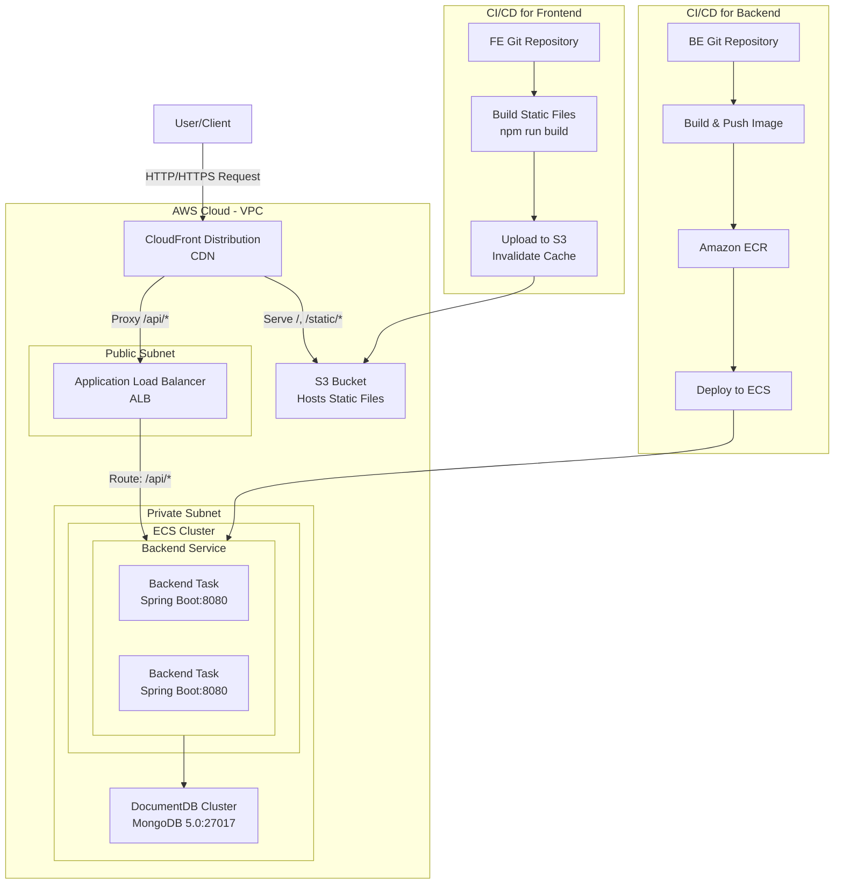

```mermaid
flowchart TD
    User[User/Client]
    subgraph AWS Cloud [AWS Cloud - VPC]
        subgraph PublicSubnet [Public Subnet]
            ALB[Application Load Balancer<br>ALB]
        end

        subgraph PrivateSubnet [Private Subnet]
            subgraph ECSCluster [ECS Cluster]
                subgraph BEService [Backend Service]
                    BETaskA[Backend Task<br>Spring Boot:8080]
                    BETaskB[Backend Task<br>Spring Boot:8080]
                end
            end

            DB[DocumentDB Cluster<br>MongoDB 5.0:27017]
        end

        CF[CloudFront Distribution<br>CDN]
        S3[S3 Bucket<br>Hosts Static Files]

        ALB -->|Route: /api/*| BEService
        BEService --> DB
    end

    User -->|HTTP/HTTPS Request| CF
    CF -->|Serve /, /static/*| S3
    CF -->|Proxy /api/*| ALB

    subgraph CICD_FE [CI/CD for Frontend]
        CodeRepo_FE[FE Git Repository]
        Build_FE[Build Static Files<br>npm run build]
        Deploy_FE[Upload to S3<br>Invalidate Cache]
    end

    subgraph CICD_BE [CI/CD for Backend]
        CodeRepo_BE[BE Git Repository]
        Build_BE[Build & Push Image]
        ECR[Amazon ECR]
        Deploy_BE[Deploy to ECS]
    end

    CodeRepo_FE --> Build_FE --> Deploy_FE --> S3
    CodeRepo_BE --> Build_BE --> ECR --> Deploy_BE --> BEService
```
